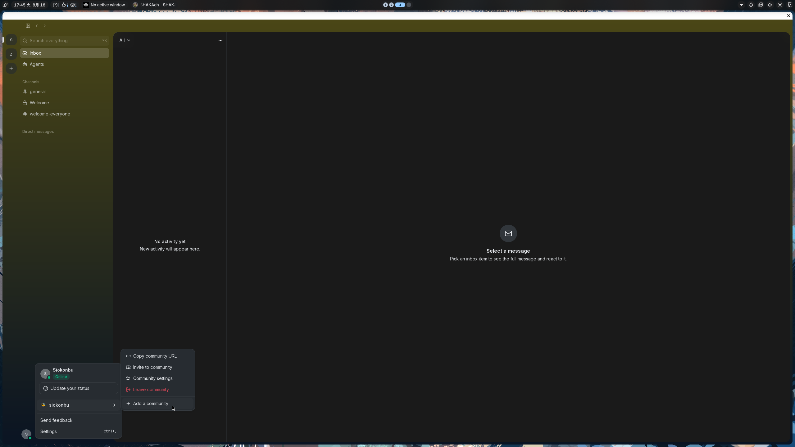
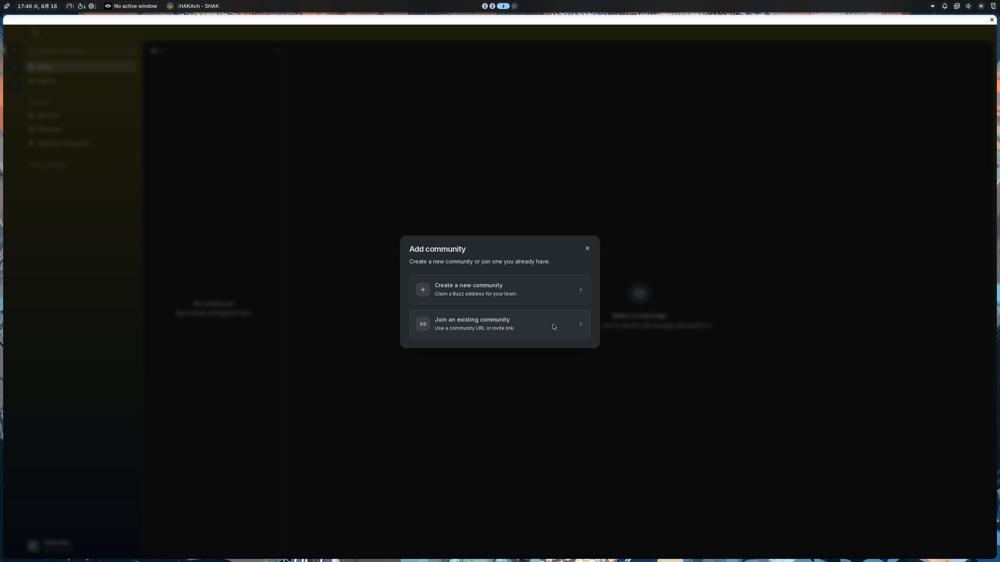
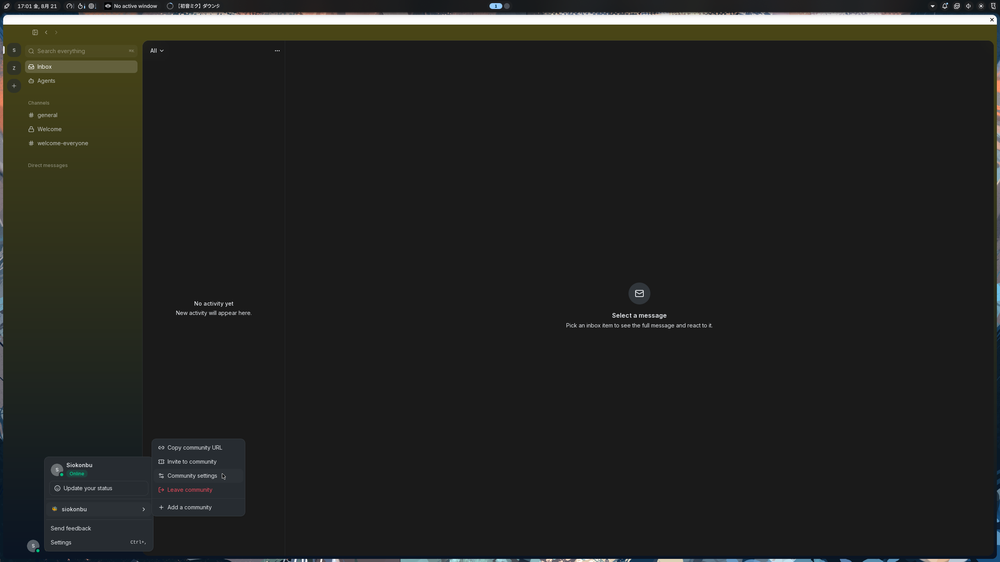
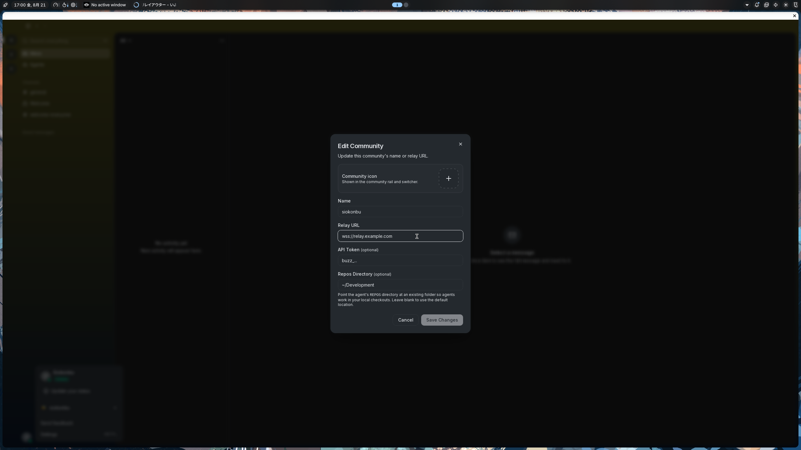

# buzz用にお一人様nostr relayを立てる。

## buzz

[buzz](https://github.com/block/buzz/tree/main)

block open sourceが手掛けるコミュニティチャットアプリです。

AI Agentと人間が同じワークスペースで作業できるやつらしい。

そして、このプロダクトの特徴がnostr relayを使ってること。

nostr relayということは！自分でも建てれるはず！

ということでお一人様relayを立てていきます。

### 環境

- macOS Tahoe
- colima(container runtime)

## Dockerでbuzzのrelayを立てる

今回は以下のドキュメントを元にやらせていただく。
[Quick Sart](https://github.com/block/buzz/tree/main/deploy/compose)

```sh
git clone git@github.com:block/buzz.git
cd buzz/deploy/compose
cp .env.example .env
```
エディタで.envを編集する

- RELAY_OWNER_PUBKEY: 自身のnostrの公開鍵をhexに変換した文字列
  - [Convert Nostr Key](https://nostr-tools.com/)
- BUZZ_RELAY_PRIAVTE_KEY,
  BUZZ_GIT_HOOK_HMAC_SECRET: 64文字の英数字のみの適当な文字列
  - `$ openssl rand -hex 64`
- POSTGRES_PASSWORD,
  REDIS_PASSWORD: 32文字の英数字のみの適当な文字列
  - `$ openssl rand -base64 24 | tr -d '/+='`
- BUZZ_S3_ACCESS_KEY,
  BUZZ_S3_SECRET_KEY: base64で生成した32文字の文字列
  - `$ openssl rand -base64 32`

編集し終わったら`./run.sh start`で走らせればlocalhost:3000で接続できるrelayが立つよ〜

## buzzからリレーの接続方法

アカウント登録をしたあとにホーム画面左下のcommunityから新たに追加して、urlを入力することで入ることができる。



ローカルで立てた際のurlは`http://localhost:3000`


***

## 公開したい

ローカルだけだと流石に使いづらいのでサーバーを公開する。

`.env`をもう一度開いて以下の項目に自身の持っているdomain等々を設定する。

```.env
- BUZZ_DOMAIN
- RELAY_URL
- BUZZ_MEDIA_BASE_URL
- BUZZ_MEDIA_SERVER_DOMAIN
- BUZZ_CORS_ORIGINS
```

そんでもって今回はポート開放したくないのでcloudflare tunnelを通す。
（tunnel通すところまでは面倒なので割愛。多分調べたら大量に出てくる。）

tunnelを通せたら`/etc/cloudflared/config.yml`を設定する。

```config.yml
tunnel: <************>
credentials-file: /***/***/***.json

ingress:
	- hostname: buzz.example.com
	  service: http://localhosts:3000
	  
	- service: http_status:404
```

これでtunnelのserviceを再起動させたら公開ができる。

一応確認のcurlやっておくのをおすすめします。

```sh
curl https://buzz.example.com
```

あとはさっき追加したcommunityのurlを変更したら接続できます。

ここでのurlはrelayのurlなので`RELAY_URL`で設定した`wss://`から始まるやつです。






## mobileとペアリングするためのサーバーを立てる

mobileでも使いたいなと思い、settingからペアリングしようとすると404 errorが出現。

どうやら、ペアリング用にサーバーを立てる必要があるらしい。

`compose.yml`にrelayと同じイメージを追加し、pairing-relayとして起動するとできるらしい。(ai談)

```config.yml
services:
  pairing-relay:
    image: ${BUZZ_IMAGE:-ghcr.io/block/buzz:main}
    entrypoint: ["/usr/local/bin/buzz-pair-relay"]
    environment:
      BUZZ_PAIR_RELAY_BIND_ADDR: "0.0.0.0:5000"
    ports:
      - "${BUZZ_PAIR_PORT:-5000}:5000"
    healthcheck:
      test: ["CMD-SHELL", "bash -ec 'exec 3<>/dev/tcp/127.0.0.1/5000'"]
      interval: 10s
      timeout: 3s
      retries: 5
      start_period: 5s
    deploy:
      resources:
        limits:
          memory: 128m
    restart: unless-stopped
    networks:
      - buzz-net
```

そして、cloudflaredでもrouteを作ってあげる。

```config.yml
***

ingress:
  - hostname: zephyr.ns-siokon.f5.si
    path: /pair*
    service: http://localhost:5000

***
```

cloudflared tuunelを再起動して、`docker compose up -d pairing-relay`で起動すればペアリングができるようになるはず！

### Troubleshooting

- 勝手にws connection closedになる
これはmacosが勝手にスリープしてネットワークが切れている可能性があるので`caffeinate -dims`等でスリープを防止しているか確認する。
